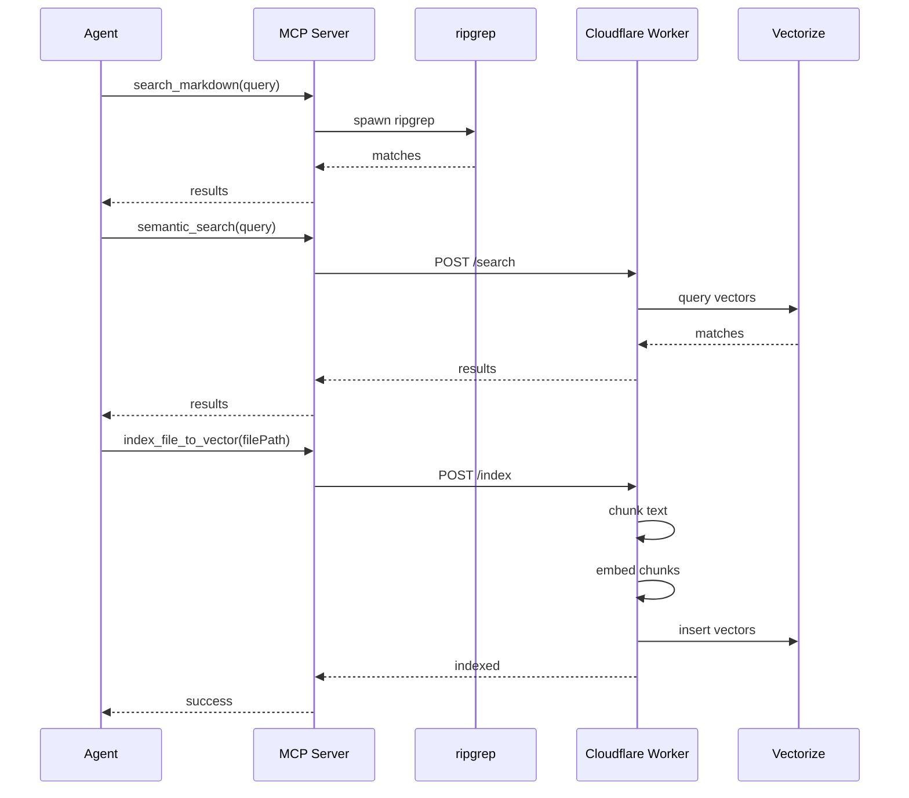

# Architecture

## Overview

This is a dual-component system:

| Component         | Location       | Runtime | Purpose                        |
| ----------------- | -------------- | ------- | ------------------------------ |
| MCP Server        | `src/mcp.ts`   | Bun     | Exposes search tools via stdio |
| Cloudflare Worker | `src/index.ts` | Workers | Semantic search, indexing      |

## MCP Server (`src/mcp.ts`)

The MCP server is built with the Model Context Protocol SDK and exposes 6 tools:

| Tool                   | Description                             |
| ---------------------- | --------------------------------------- |
| `search_markdown`      | Full-text search via ripgrep            |
| `semantic_search`      | Vector similarity via Cloudflare Worker |
| `list_markdown_files`  | File discovery                          |
| `read_markdown_file`   | File content retrieval                  |
| `index_file_to_vector` | Single file embedding                   |
| `index_all_to_vector`  | Bulk embedding                          |

## Cloudflare Worker (`src/index.ts`)

The Worker provides REST endpoints:

| Method | Endpoint  | Description                     |
| ------ | --------- | ------------------------------- |
| GET    | `/health` | Health check                    |
| POST   | `/search` | Vector similarity search        |
| POST   | `/index`  | Embed and store document chunks |

## Data Flow

## Embedding Model

Uses `@cf/baai/bge-base-en-v1.5` model:

- 768-dimensional embeddings
- Optimized for English retrieval
- BAAI standard benchmark accuracy

## Chunking Strategy

1. Split on markdown headings (`#`, `##`, `###`)
2. If section exceeds `CHUNK_SIZE`, use sliding window
3. Apply `CHUNK_OVERLAP` between windows
4. Filter out chunks < 20 characters

## Testing Strategy

### Unit Tests

Lib modules (`chunker.ts`, `walker.ts`) are unit-tested with `bun test`.

### Worker Route Tests

`worker-routes.test.ts` tests Worker routes in-process using Hono's `app.request()`.

### MCP Worker HTTP Tests

`mcp-worker.test.ts` tests the Worker via live HTTP requests:

| Describe              | Guard                     | Tests                                               |
| --------------------- | ------------------------- | --------------------------------------------------- |
| `MCP Endpoints`       | `WORKER_URL` required     | `GET /`, `GET /health`, validation (400), handlers  |
| `MCP Auth (enforced)` | `WORKER_URL + MCP_SECRET` | `401` for missing/wrong `X-MCP-Secret` header       |
| `MCP Auth (bypassed)` | `WORKER_URL` only         | `500` from missing AI/Vectorize (auth not enforced) |

Auth bypass: when `MCP_SECRET` is not set, `authenticate()` returns `true` for all requests.

### CI Integration Testing

The `ci.yml` workflow runs MCP integration tests in the `integration` job (after `quality`):

1. Starts `wrangler dev --remote` with Cloudflare credentials (AI/Vectorize available)
2. Runs all MCP tests with `WORKER_URL=http://localhost:8787 MCP_SECRET=ci-secret`
3. Kills the dev server

The `preview.yml` workflow only handles Cloudflare deployment + PR URL comment.

## Storage

- **Vectorize**: Stores embeddings with metadata (filePath, chunkIndex, preview)
- **R2**: (planned) for PDF storage in future versions
